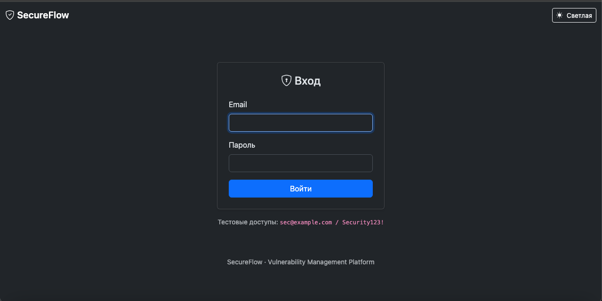
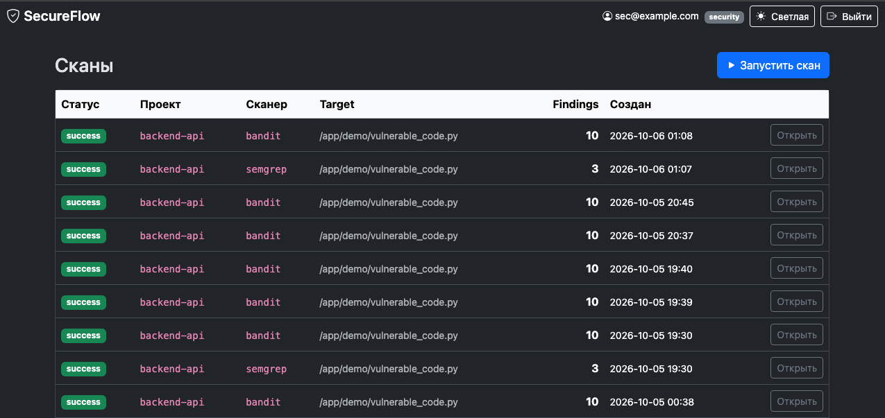
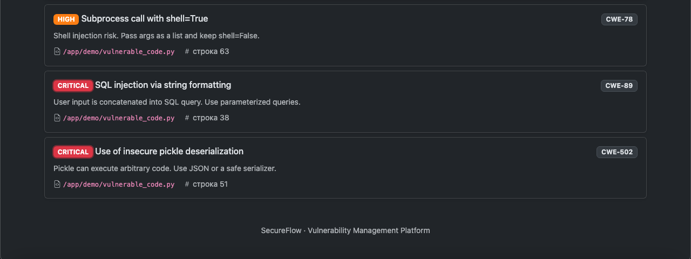
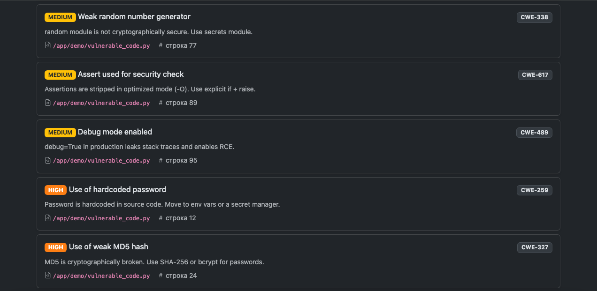
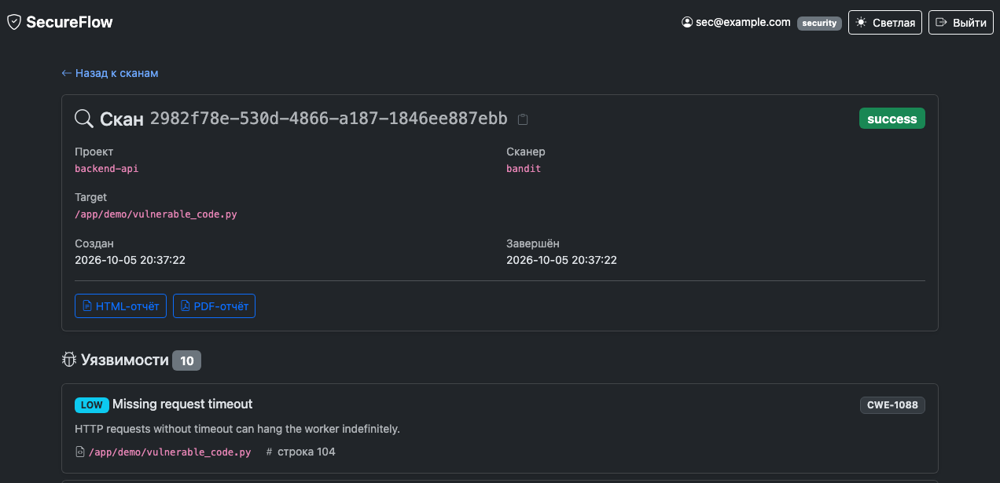
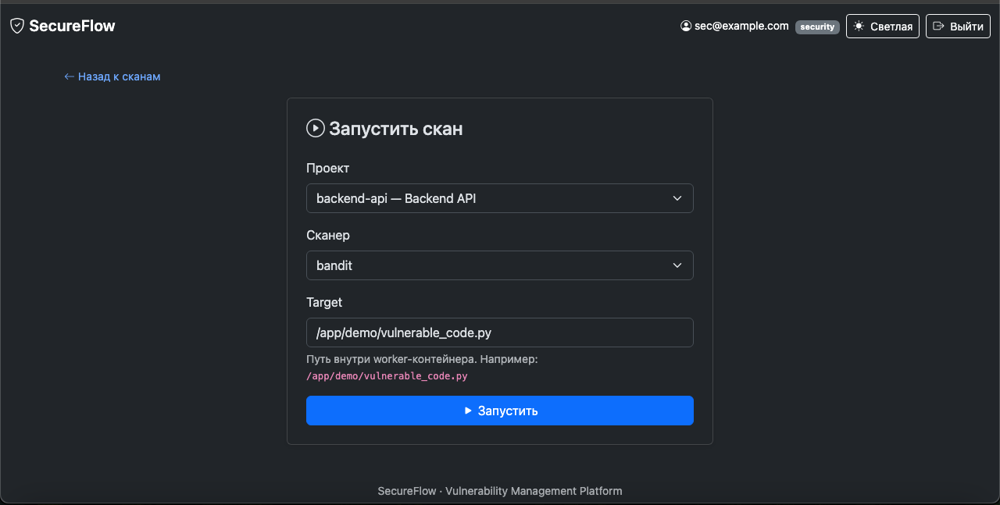
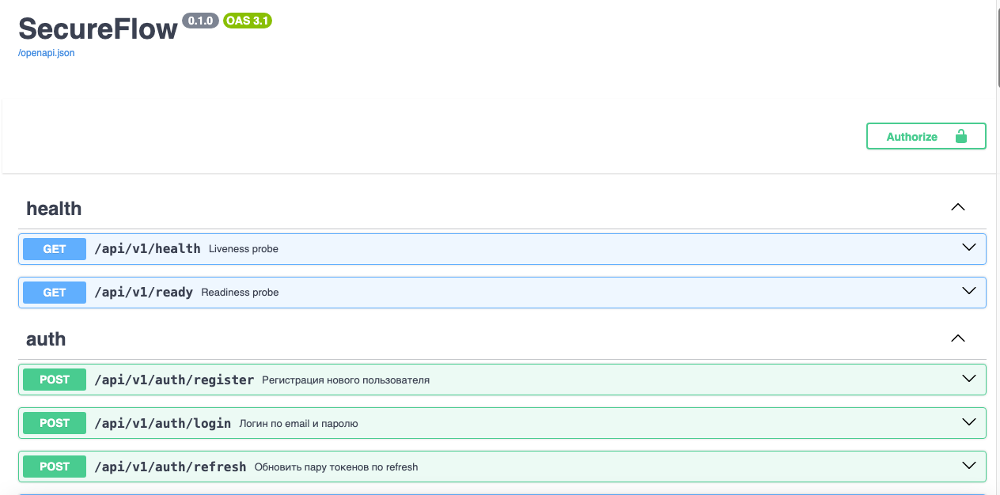

# 🛡️ SecureFlow

> Vulnerability Management Platform для AppSec-команд.
> SAST-сканирование, отчёты, GitHub-интеграция и server-rendered UI.

[](https://github.com/persival-dev/secureflow/actions/workflows/ci.yml)
[](https://www.python.org/downloads/)
[](https://fastapi.tiangolo.com/)
[](https://www.postgresql.org/)
[](https://docs.celeryq.dev/)
[](https://github.com/astral-sh/ruff)
[](https://mypy-lang.org/)
[]()

---

## 📸 Скриншоты

### Login


### Список сканов


### Деталка скана — пульсирующий CRITICAL


### Деталка скана — HIGH / MEDIUM / LOW


### Метаданные скана


### Запуск нового скана


### REST API (Swagger UI)


---

## 🎯 Что это

SecureFlow — платформа для управления уязвимостями. Принимает код через GitHub-webhooks или UI, запускает SAST-сканеры (Bandit, Semgrep), сохраняет находки, генерирует HTML/PDF-отчёты и отправляет уведомления в Telegram.

**Задачи, которые решает:**
- Автоматический SAST-скан при push в main
- Централизованное хранение уязвимостей с severity-классификацией
- Экспорт отчётов для команды и менеджмента
- Мгновенные уведомления о критичных находках

---

## ✨ Возможности

- 🔐 **Auth & RBAC** — JWT (access + refresh), роли `developer < security < admin`
- 🚀 **Async API** — FastAPI + SQLAlchemy 2.0 + asyncpg
- 🔍 **SAST-сканеры** — Bandit и Semgrep через Adapter pattern
- ⚙️ **Celery + Redis** — асинхронные задачи, отдельный worker-контейнер
- 📊 **Отчёты** — HTML (Jinja2) и PDF (WeasyPrint)
- 🐙 **GitHub webhooks** — HMAC-SHA256, автозапуск сканов при push в main
- 💬 **Telegram-уведомления** — Celery-таск с retry *(см. ограничения)*
- 🖥️ **Server-rendered UI** — Jinja2 + Bootstrap 5, cookie-auth, тёмная тема
- 🧪 **76 тестов** — pytest, rollback-изоляция, mocking httpx
- 🐳 **Docker** — multi-stage build, non-root user, healthchecks
- ✅ **CI** — GitHub Actions: Ruff + Mypy + Pytest

---

## 🛠️ Стек

| Слой | Технологии |
|------|-----------|
| Backend | FastAPI 0.115, Pydantic v2, pydantic-settings |
| БД | PostgreSQL 16, SQLAlchemy 2.0 (async), Alembic, asyncpg |
| Очереди | Celery 5.6, Redis 7 |
| Auth | PyJWT (HS256), bcrypt |
| Сканеры | Bandit, Semgrep |
| Отчёты | Jinja2 (HTML), WeasyPrint (PDF) |
| Интеграции | GitHub webhooks (HMAC-SHA256), Telegram Bot API |
| UI | Jinja2, Bootstrap 5, vanilla JS |
| Инфра | Docker, docker-compose, GitHub Actions |
| Качество | pytest, ruff, mypy |

---

## 📐 Архитектура

```
┌──────────────┐       ┌────────────────┐       ┌─────────────┐
│  Browser UI  │──────▶│   FastAPI      │──────▶│ PostgreSQL  │
│  (Jinja2)    │       │   /ui/*  /api/*│       │  (async)    │
└──────────────┘       └────────┬───────┘       └─────────────┘
                                │
                                │ .delay()
                                ▼
                       ┌────────────────┐       ┌─────────────┐
                       │   Celery       │◀─────▶│   Redis     │
                       │   worker       │       │   (broker)  │
                       └────────┬───────┘       └─────────────┘
                                │
                                ▼
                       ┌────────────────┐
                       │  Bandit /      │
                       │  Semgrep       │
                       └────────────────┘
```

**Слои:**
```
API (FastAPI) → Services → Repositories → Models (SQLAlchemy ORM)
```

**Структура:**
```
secureflow/
├── app/
│   ├── main.py                  # FastAPI factory + lifespan
│   ├── api/                     # REST API v1
│   │   ├── deps.py              # DI: get_db, get_current_user, require_role
│   │   └── v1/endpoints/        # health, auth, users, scans, vulnerabilities, webhooks
│   ├── ui/                      # Server-rendered UI (Jinja2)
│   │   ├── deps.py              # cookie-based auth
│   │   ├── pages.py             # login, scans list, detail, create, reports
│   │   └── router.py
│   ├── core/                    # config, security (JWT), webhooks (HMAC), logging
│   ├── db/                      # async session, worker session (NullPool)
│   ├── models/                  # Project, Scan, User, Vulnerability
│   ├── schemas/                 # Pydantic DTOs
│   ├── repositories/            # Repository pattern поверх ORM
│   ├── services/                # Бизнес-логика
│   │   ├── scanner/             # base + bandit + semgrep (Adapter)
│   │   └── notification.py      # Telegram через httpx
│   ├── workers/                 # Celery app + tasks
│   └── templates/               # Jinja2 шаблоны
├── alembic/versions/            # миграции
├── tests/                       # 76 тестов
├── scripts/
│   ├── create_admin.py          # CLI для создания админа
│   └── seed_demo.py             # демо-данные (для скриншотов)
├── docs/screenshots/            # скриншоты для README
├── demo/vulnerable_code.py      # тестовый файл с намеренными уязвимостями
├── docker/Dockerfile            # multi-stage build
├── .github/workflows/ci.yml     # Ruff + Mypy + Pytest
└── docker-compose.yml + override.yml
```

---

## 🚀 Быстрый старт

### Требования
- Docker Desktop
- Git

### Запуск

```bash
git clone https://github.com/persival-dev/secureflow.git
cd secureflow

# 1. Конфиг
cp .env.example .env
# отредактируй SECRET_KEY — минимум 32 символа

# 2. Инфраструктура
docker compose up -d
sleep 30
docker compose ps   # все сервисы должны быть healthy

# 3. Миграции
docker compose exec api alembic upgrade head

# 4. Демо-данные (юзеры + проект + скан с 10 уязвимостями)
docker compose exec api python -m scripts.seed_demo
```

### Доступ

| Что | URL |
|-----|-----|
| **Web UI** | http://127.0.0.1:8000/ui/login |
| Swagger API | http://127.0.0.1:8000/docs |
| Healthcheck | http://127.0.0.1:8000/api/v1/health |

**Тестовые доступы:**
| Email | Пароль | Роль |
|-------|--------|------|
| `admin@example.com` | `SuperSecret123!` | admin |
| `sec@example.com` | `Security123!` | security |
| `dev@example.com` | `Developer123!` | developer |

### Что попробовать

1. Залогинься в UI под `sec@example.com`.
2. Открой скан от seed — увидишь 10 уязвимостей с severity-бейджами.
3. Нажми **«Запустить скан»** → выбери `backend-api` / `bandit` / дефолтный target.
4. Через ~5 секунд скан завершится, появятся свежие находки.
5. Скачай HTML/PDF-отчёт со страницы скана.
6. Переключи тёмную тему кнопкой в navbar (сохраняется в localStorage).

---

## 🧪 Тесты

```bash
# Локально (Postgres должен быть доступен на localhost:5432)
POSTGRES_HOST=localhost pytest tests/ -v

# С покрытием
POSTGRES_HOST=localhost pytest tests/ --cov=app --cov-report=term-missing
```

**76 тестов, покрытие:**
- API — auth, RBAC, scans, vulnerabilities, reports (HTML/PDF)
- UI — login, cookie-auth, route ordering regression, reports proxy
- Scanners — Bandit, Semgrep (моки subprocess)
- Notifications — Telegram через моки httpx

---

## 🔑 Ключевые решения

| Решение | Обоснование |
|---------|-------------|
| **UUID** вместо BIGSERIAL | Не утекает количество записей через ID |
| **`values_callable` в SAEnum** | Строчные значения (`critical` вместо `CRITICAL`) в БД и JSON |
| **`expire_on_commit=False`** | Избегаем `MissingGreenlet` в async SQLAlchemy |
| **`selectinload()`** | Защита от N+1 при обращении к relationships |
| **Repository pattern** | Изоляция ORM от бизнес-логики, мокаемость в тестах |
| **`subprocess.run(shell=False)`** | Защита от RCE при запуске сканеров |
| **`asyncio.run() + NullPool`** в worker | Sync Celery ↔ async SQLAlchemy без cross-loop |
| **`_DUMMY_HASH` в auth** | Защита от user enumeration через timing |
| **`autoescape=True` в Jinja2** | XSS-защита в отчётах |
| **Extras `[scanner]`, `[reports]`** | Тяжёлые зависимости только в Docker/CI |
| **HMAC-SHA256 + `hmac.compare_digest`** | Constant-time сравнение подписи |
| **`await request.body()` до `request.json()`** | FastAPI кеширует только одно представление |
| **Cookie-based auth в UI** | Браузер не умеет `Authorization: Bearer` в навигации |
| **`response_model=None` на UI POST** | FastAPI не строит схему из `RedirectResponse \| HTMLResponse` |
| **Route order: `/create` выше `/{id}`** | FastAPI матчит сверху вниз, `"create"` не должен парситься как UUID |
| **UI-прокси к ReportService** | Отчёты на `/ui/scans/{id}/report` — cookie-auth, чтобы `<a href>` работал в браузере |

---

## ⚠️ Ограничения

- **Telegram-уведомления** — API заблокирован в РФ. В Docker-контейнере требуется `HTTPS_PROXY`. Код работает из коробки вне РФ. Локально протестирован с `TELEGRAM_ENABLED=false` + 4 unit-теста с моками httpx.
- **PR-сканирование** — событие `pull_request` обрабатывается, но diff-анализ не реализован.
- **React-фронтенд** — намеренно используется Jinja2 + Bootstrap (server-rendered). React в планах.
- **CSRF** — `SameSite=Lax` частично защищает UI-формы, полноценный CSRF-токен не реализован.

---

## 🗺️ Roadmap

- [x] Week 1 — Docker, async SQLAlchemy, Alembic, CRUD
- [x] Week 2 — JWT auth, RBAC, Celery + Bandit + Semgrep
- [x] Week 3 — HTML/PDF отчёты, CI, GitHub webhooks, Telegram
- [x] Week 4 — Server-rendered UI (Jinja2 + Bootstrap + dark theme), 76 тестов
- [ ] DAST-сканеры (ZAP, nuclei)
- [ ] PR diff-сканирование
- [ ] React-фронтенд (SPA)
- [ ] Prometheus + Grafana метрики
- [ ] Kubernetes deployment

---

## 📄 Лицензия

MIT